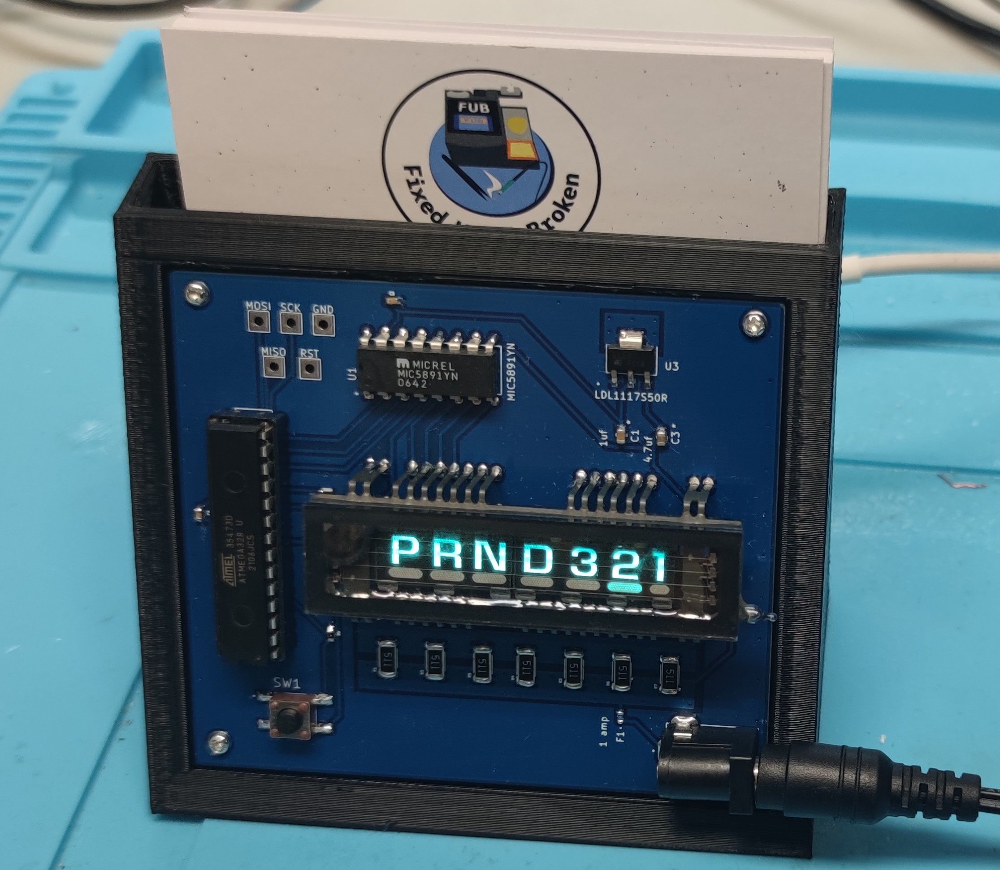
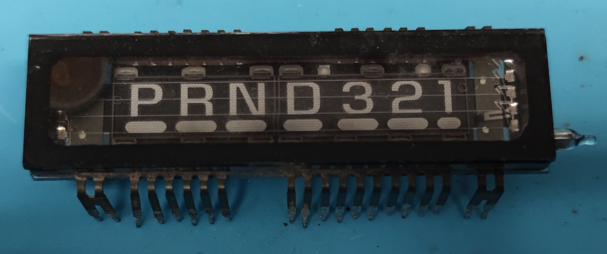
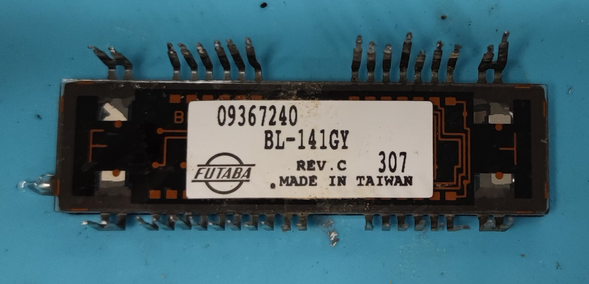
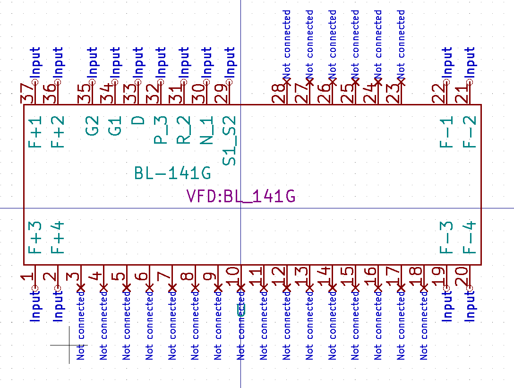
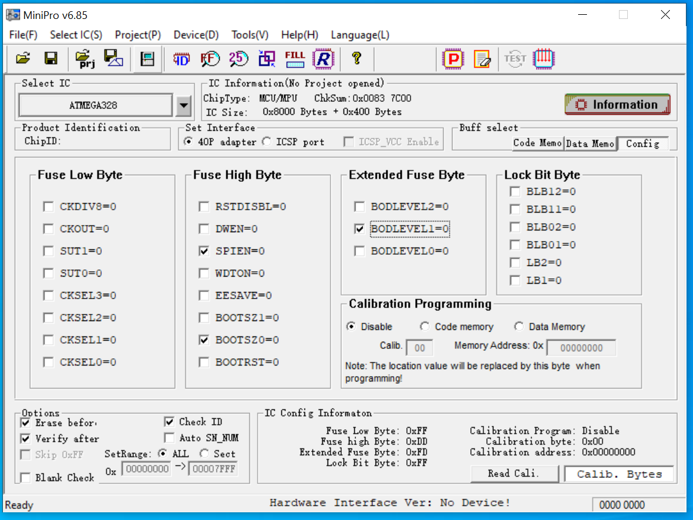

# Futaba VFD Controlled by Arduino
This is an Arduino-based project using Futaba vacuum fluorescent displays.  In this project, I used Futaba part number BL-141G (GM part number 09367240), a MIC5891 to drive the screen, and an Arduino. This Vacuum Fluorescent Display is off of a 03-05 GM Truck Instrument Clusters and on Trailblazers. The Arduino code is a rough sketch to get started with but functions well. 

My PCB are from [JLCPCB](https://jlcpcb.com/IAT), new users have $30 coupons [here](https://jlcpcb.com/IAT)

Design work was done in Kicad

Video 1: https://youtu.be/h8Us6riXLtg
Video 2: https://youtu.be/K12hVGqjaFM

# Goal
The goal of this project to make footprints and working examples of existing VFDs that are "out in the wild". Unfortunately Futaba would not providde datasheets. This project guide contains the files necessary to help you step by step produce your own PCB using the screens

# Screens
Right now the only screen supported is Futaba BL-141G. I do have access to more of them and will add support over time. The goal is to do the BL-186GIN next. It is found in 07-14 GM truck cluster.

BL-141G Front

BL-141G Back

# Kicad Files
 bl-141g.lib is the symbol and BL-141G.kicad_mod is the footprint.

# Housing & 3D Printing
The housing is open air to show off the PCB. It also helps with cooling the resistors for the VFD filiment. I will try to keep the board footprint the same in future projects with VFDs so that way this same housing can be used on it. I 3d printed it 20% infill and supports with PETG. [Housing](housing.stl) The housing itself is designed to hold business cards so that way it is a functional work of desk art.

# Assembly & Programming
This smallest compents are 0603 so this is achiveable at home with any decent soldering iron. The XTAL is going to need hot air or hotplate. If you are salvaging the screen yourself off a GM Truck CLuster you can also salvage the 510 ohm resistors off the board at the same time if building the BL-141G. I personally prefer to use solderpaste and hot air for all the SMT components myself.

As for programming you can use an arduino as ISP using the header provided above the Microcontroller. I personally prefer to use a TL866 to program them. Attached Below is a screenshot of the Fuse setting for the ATmega328 

